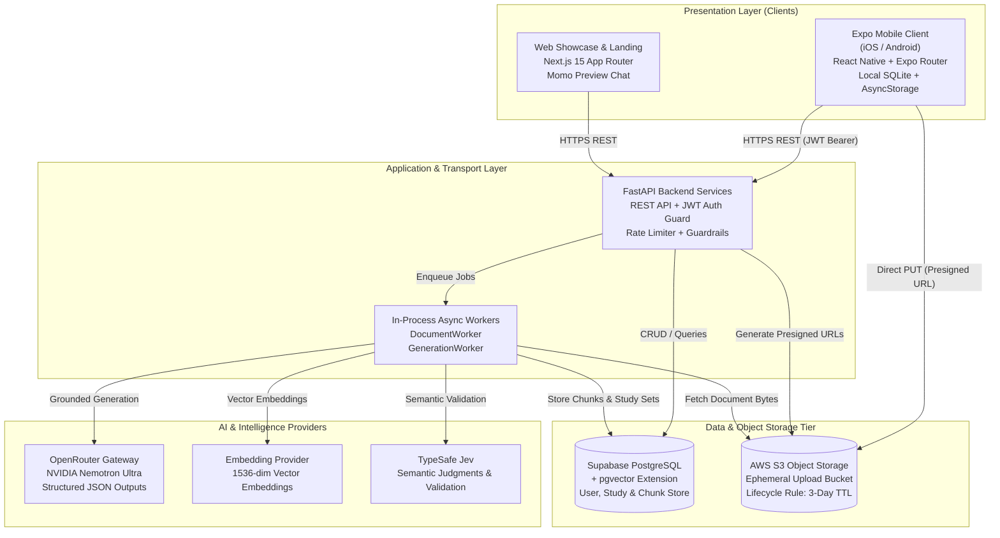
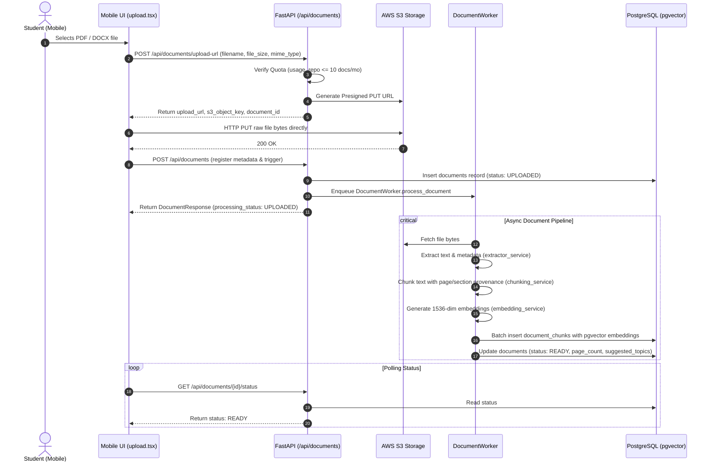
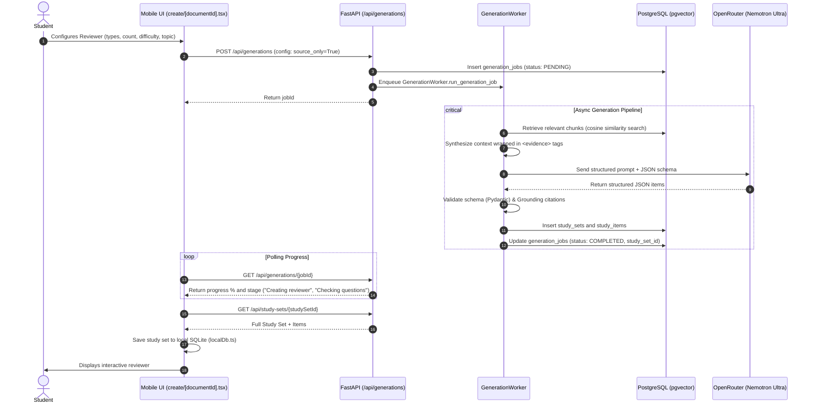
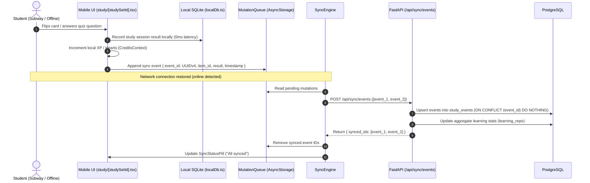
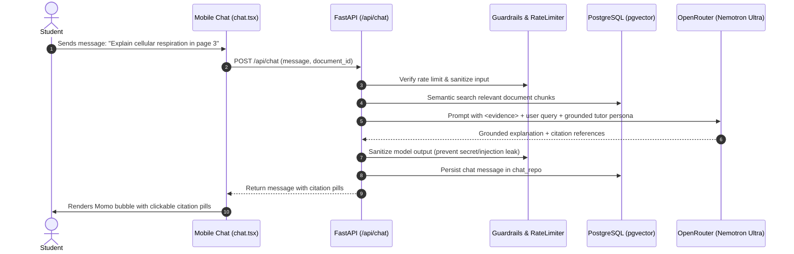
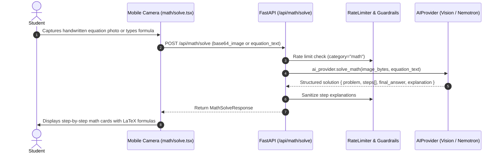

# AI Study Platform — System Architecture & Agent Invariant Contract

> **Master Architecture Specification**  
> *Primary Product:* Momo AI Study Platform  
> *Governing Documents:* [`ARD_PRD.md`](./ARD_PRD.md), [`AGENTS.md`](./AGENTS.md), [`SKILL.md`](./SKILL.md)  
> *Status:* Authoritative Contract for Engineers and Autonomous Agents  

---

## Executive Summary & Core Philosophy

This architecture document codifies the design, boundaries, data flows, and non-negotiables of the **Momo AI Study Platform**.

The platform enables students and exam candidates to transform uploaded educational documents (PDF, DOCX, TXT, PPTX) into grounded, interactive study materials (Flashcards, Quizzes, Identification, Math solutions, and Summaries). 

### The Core Architectural Tenet
**The original uploaded document is ephemeral (deleted after 3 days). The generated study material is permanent.**

```text
Uploaded Document (AWS S3)  ──[3 Days TTL]──> Auto-Deleted
           │
           ▼ (Async Worker: Extraction + Chunking + pgvector)
Grounded Study Sets (PostgreSQL + SQLite) ──[Permanent]──> Retained Indefinitely
```

This document establishes the intent behind every architectural decision. Agents and developers must never alter these patterns under the guise of "refactoring" or "optimization" without explicit human approval.

---

## 1. What's in the System? (System Topology & Component Map)

The platform is structured as a coordinated full-stack monorepo encompassing client applications, backend services, cloud databases, ephemeral storage, and external AI providers.



### Component Inventory

1. **Expo Mobile Client (`mobile/`)**
   - **Framework:** React Native, Expo SDK, TypeScript, Expo Router (file-based navigation).
   - **Local Storage:** Expo SQLite (`mobile/lib/storage/localDb.ts`) for zero-latency offline study decks and quiz runs.
   - **Client Economy & Gamification:** `CreditsContext.tsx` with `AsyncStorage` managing hearts, XP, and mascot items.
   - **Offline Synchronization:** `syncEngine.ts` and `mutationQueue.ts` for queued background mutation dispatch.
   - **API Integration:** Centralized API client (`mobile/lib/api/client.ts`) utilizing fetch with Bearer token injection.

2. **Web Showcase & Landing (`web/`)**
   - **Framework:** Next.js 15 App Router, React 19, TypeScript, Tailwind CSS.
   - **Role:** Product marketing, app store redirection, interactive demo mockups, and preview chat with Momo persona.

3. **Backend Services (`backend/app/`)**
   - **Framework:** Python 3.11+, FastAPI, Pydantic v2.
   - **Security:** Supabase JWT validation (`app/dependencies.py`), sliding window rate limiter (`app/services/security/rate_limiter.py`), and regex/credential guardrails (`app/services/security/guardrails_service.py`).
   - **Background Execution:** FastAPI `BackgroundTasks` driving `DocumentWorker` and `GenerationWorker`.
   - **Database Access:** Dedicated repository layer (`app/db/repositories/`) executing parameterized SQL via connection pooling.

4. **Primary Database (Supabase PostgreSQL + `pgvector`)**
   - **Relational Tables:** `users`, `documents`, `generation_jobs`, `study_sets`, `study_items`, `folders`, `study_events`.
   - **Vector Store:** `document_chunks` table indexing 1536-dimension embeddings with IVFFlat / HNSW indexes for cosine distance search.

5. **Ephemeral Object Storage (AWS S3)**
   - **Bucket Policy:** Private bucket with strict AWS Lifecycle Rule deleting objects older than 3 days.
   - **Key Structure:** `documents/{user_id}/{document_id}/{filename}`.
   - **Upload Strategy:** Client-side direct uploads via presigned S3 PUT URLs generated by FastAPI.

6. **External AI & Validation Services**
   - **LLM Engine:** NVIDIA Nemotron Ultra via OpenRouter gateway for grounded generation and explanations.
   - **Embeddings:** 1536-dimensional embedding models for RAG indexing.
   - **Semantic Validation:** TypeSafe Jev for bounded semantic decisions and grounding verdicts.

---

## 2. Who's Responsible for What? (Single-Ownership Model)

Every system responsibility has **exactly one** authoritative owner. Shared or ambiguous ownership is strictly forbidden.

| Responsibility / Domain | Authoritative Owner | Role of Owner | Prohibited Actors |
| :--- | :--- | :--- | :--- |
| **User Identity & Auth** | Supabase Auth (Issuer) + Backend `dependencies.py` (Verifier) | Issues JWT; backend cryptographically verifies signature and derives authenticated user identity (`AuthenticatedUser`). | Mobile client, Web frontend, or untrusted request parameters cannot claim or spoof `user_id`. |
| **Document Quotas** | Backend `usage_repo.py` in PostgreSQL | Enforces strict monthly limit of 10 uploaded documents per user. | Mobile client cannot track or bypass quota limits; client displays quota but cannot authoritatively enforce it. |
| **Document S3 Lifecycle** | AWS S3 Lifecycle Configuration + `storage_service.py` | Automatically purges files after 3 days; calculates expiration timestamps for metadata. | Generation jobs and study sets must never depend on the S3 file persisting past 3 days. |
| **Text Extraction & OCR** | Backend `extractor_service.py` & `ocr_service.py` | Extracts text from PDF, DOCX, TXT, PPTX; triggers OCR only on scanned/image-based documents. | Mobile app never extracts text; workers never run OCR unless normal text extraction yields insufficient text. |
| **Chunking & Embeddings** | Backend `chunking_service.py` & `embedding_service.py` | Splits text preserving page/section provenance; computes vector embeddings. | Storage layer or API routes never perform chunking directly. |
| **Study Generation & RAG** | Backend `generation_worker.py` | Orchestrates vector retrieval, evidence synthesis, OpenRouter Nemotron calls, and schema parsing. | Mobile client never calls OpenRouter; API routes never run generation synchronously in the HTTP cycle. |
| **Grounding & Schema Validation** | Backend `validation_service.py` & Pydantic | Validates generated JSON against models (`StudyItem`) and verifies that citations match source chunks. | AI providers or database drivers must not store unvalidated raw LLM text. |
| **Gamification & Economy** | Mobile `CreditsContext.tsx` (`AsyncStorage`) | Manages hearts, XP, and Momo Coins locally for zero-latency UI responsiveness. | Backend does not block mobile UI on coin/heart updates; records events via sync. |
| **Offline Cache & Study State** | Mobile SQLite (`localDb.ts`) | Authoritative local store for downloaded study sets, cards, and offline interactions. | Cloud database is not queried when studying offline. |
| **Progress Sync Ledger** | Backend `sync_repo.py` & `learning_repo.py` | Processes queued offline study events idempotently using client-generated `event_id`s. | Client cannot overwrite existing historical server events; duplicates are ignored safely. |

---

## 3. Why Is It Built This Way? (Deliberate Architectural Choices)

The following architectural decisions are intentional and solve specific domain problems. Agents must **not** attempt to change or "clean up" these designs.

### 3.1 Ephemeral 3-Day S3 Retention vs. Persistent Study Sets
*   **The Decision:** Original documents in S3 are deleted after 72 hours. Study sets, study items, and chunks persist indefinitely. Foreign keys linking study sets to documents use `ON DELETE SET NULL`.
*   **The Rationale:** Student documents may contain copyrighted textbook excerpts, proprietary exam materials, or personal lecture notes. Retaining them permanently creates unnecessary legal liability and storage costs. Once the AI extracts grounded study items and embeds knowledge chunks, the original binary is no longer needed.
*   **Anti-Pattern Blocked:** Never introduce cascade deletion (`ON DELETE CASCADE`) from documents to study sets. Deleting an S3 file or document record must **never** delete user study sets.

### 3.2 Direct Presigned S3 Uploads
*   **The Decision:** The mobile app requests a presigned PUT URL from `POST /api/documents/upload-url` and uploads binary files directly to AWS S3. The file bytes never touch the FastAPI server.
*   **The Rationale:** Educational documents can reach 15 MB / 50 pages. Streaming multi-megabyte payloads through FastAPI would tie up Python asynchronous worker threads and memory during slow mobile connections. Direct S3 uploads keep the API fast and horizontally scalable.
*   **Anti-Pattern Blocked:** Never add a `multipart/form-data` upload endpoint to FastAPI that accepts raw document file streams.

### 3.3 Strict `source_only = True` Grounding Invariant
*   **The Decision:** System prompts explicitly instruct Nemotron Ultra that document content is the *only* source of truth. If evidence is missing, the model returns a controlled insufficiency result rather than hallucinating answers from pre-trained knowledge.
*   **The Rationale:** Students study for high-stakes exams (medical, nursing, legal, engineering). Hallucinated answers cause students to fail exams. The app must be an authentic study reviewer, not a creative chatbot.
*   **Anti-Pattern Blocked:** Never "help" the user by enabling generic web search or broad model knowledge fallbacks during study set generation.

### 3.4 Local SQLite Cache + Idempotent Mutation Queue on Mobile
*   **The Decision:** Study sets and items are cached in SQLite on the mobile device. Quiz answers and card flips update SQLite instantly and append mutation records to a queue. The queue synchronizes to `/api/sync/events` when online.
*   **The Rationale:** Students study on buses, subways, and campus areas with spotty cell reception. Flashcard flips and quiz evaluations must have 0ms latency. The mutation queue ensures no study progress is lost during disconnections.
*   **Anti-Pattern Blocked:** Never require an active internet connection to flip a flashcard or answer a quiz question in an existing study set.

### 3.5 Polling over WebSockets for Long-Running Generation Jobs
*   **The Decision:** Mobile polls `GET /api/generations/{jobId}` every 2–3 seconds until completion.
*   **The Rationale:** On mobile devices (iOS/Android), applications enter background suspension when the user switches apps or locks their screen. WebSocket connections drop and require complex reconnection protocols. Polling is stateless, survives app suspension, works seamlessly behind HTTP proxies, and simplifies horizontal API scaling.
*   **Anti-Pattern Blocked:** Do not replace polling with WebSockets or Server-Sent Events (SSE) for document and generation status.

---

## 4. What's Allowed to Touch What? (Layering & Explicit Bans)

The architecture enforces a strict **Four-Tier Clean Dependency Direction**. Dependencies must point inward from Presentation to Infrastructure.

```text
Presentation Layer (Mobile UI / Web Showcase)
        │
        ▼
Application & Transport Layer (FastAPI Routes / Middleware / Auth Guards)
        │
        ▼
Domain Layer (Domain Services / Workers / AI Abstractions / Validation)
        │
        ▼
Infrastructure Layer (Repositories / Database / S3 / External APIs)
```

### Dependency Rules

1.  **Mobile Presentation (`mobile/app/`, `mobile/components/`)**:
    - May communicate with `mobile/lib/api/` and `mobile/context/`.
    - May read/write to local SQLite (`mobile/lib/storage/localDb.ts`) and `AsyncStorage`.
    - **MUST NEVER** import or call Supabase database tables directly.
    - **MUST NEVER** hold AWS credentials or call OpenRouter / OpenAI directly.

2.  **API Routes (`backend/app/api/routes/`)**:
    - May validate requests via Pydantic schemas (`backend/app/schemas/`).
    - May authenticate via dependency injection (`app.dependencies.get_current_user`).
    - May delegate work to Domain Services (`app.services`) or Repositories (`app.db.repositories`).
    - May enqueue background tasks via `BackgroundTasks`.
    - **MUST NEVER** execute raw SQL queries directly inside route handlers.
    - **MUST NEVER** construct AI prompts or invoke LLMs directly inside route handlers.

3.  **Domain Services & Workers (`backend/app/services/`, `backend/app/workers/`)**:
    - Contain all core business logic (extraction, chunking, RAG context synthesis, validation, AI generation).
    - May call Repositories to read or persist data.
    - May invoke infrastructure clients (`storage_service`, `ai_provider`).
    - **MUST NEVER** import FastAPI `Request`, `Response`, or route-specific types.

4.  **Repositories (`backend/app/db/repositories/`)**:
    - Encapsulate all database operations against PostgreSQL / Supabase.
    - All queries must use parameterized SQL to prevent SQL injection.
    - **MUST NEVER** import or execute domain business logic or call AI services.

### Explicit Architectural Bans

```text
❌ BANNED: Mobile Client ─────── direct query ────────> Supabase PostgreSQL
❌ BANNED: Mobile Client ─────── direct request ──────> OpenRouter / LLM APIs
❌ BANNED: API Route Handlers ── raw SQL query ───────> Database
❌ BANNED: Background Workers ── synchronous block ───> HTTP Response Loop
❌ BANNED: Untrusted Content ─── raw unescaped string ─> LLM System Prompt
❌ BANNED: Document Deletion ─── CASCADE delete ──────> Study Sets / Study Items
```

---

## 5. How Does Data Actually Move? (5 Canonical End-to-End Flows)

### Flow 1: Direct-to-S3 Document Ingestion & Vector Indexing



---

### Flow 2: Grounded RAG Study Set Generation (Polled Pipeline)



---

### Flow 3: Offline-First Study Session & Idempotent Event Sync



---

### Flow 4: Grounded Momo AI Tutor Chat with Citations



---

### Flow 5: Math & Camera Solver Flow



---

## 6. What Can Never Break? (The 6 Non-Negotiables)

These six architectural invariants are absolute. No code changes, feature additions, or agent actions may violate them.

### Invariant 1: Secrets Stay Server-Side
*   **Rule:** AWS credentials, OpenRouter API keys, Supabase Service Role keys, and TypeSafe Jev keys must exist solely as backend environment variables.
*   **Validation:** Never embed secrets in Expo `app.json`, `.env` files distributed with mobile builds, or git repositories.

### Invariant 2: Ephemeral Document Decoupling
*   **Rule:** The automatic or manual deletion of an S3 document or its database record must **never** delete generated study sets, study items, or student study logs.
*   **Validation:** Foreign keys on `study_sets.document_id` must use `ON DELETE SET NULL`. Unit tests must assert that study sets persist when the document record is deleted.

### Invariant 3: Grounding First (`source_only = True`)
*   **Rule:** Generated content must be grounded exclusively in the provided document chunks. The model must never hallucinate external facts.
*   **Validation:** Every generated study item must contain valid `source_metadata` referencing a specific page or section. Untrusted document content must always be enclosed within explicit delimiter tags (`<evidence>...</evidence>`) to neutralize prompt injection attacks.

### Invariant 4: Server-Enforced Quota & Identity
*   **Rule:** The 10-document monthly quota and authenticated user identity must be enforced strictly server-side in FastAPI.
*   **Validation:** The backend must derive identity solely from the validated Supabase JWT token. Client-provided `user_id` fields in request bodies must never be accepted as proof of identity.

### Invariant 5: Strict Boundary Preservation
*   **Rule:** No layer may bypass adjacent layers. Mobile clients must never execute direct SQL or call external AI endpoints.
*   **Validation:** All mobile data fetching flows through `mobile/lib/api/` calling FastAPI endpoints. Backend routes must never contain raw SQL queries.

### Invariant 6: Idempotent Event Synchronization
*   **Rule:** Offline mutation sync must be completely idempotent.
*   **Validation:** Every client mutation generated offline must contain a client-side UUID `event_id`. The backend must safely ignore duplicate submissions of the same `event_id` without corrupting user statistics or XP counters.

---

## 7. Where Does New Code Belong? (Strict Extension Matrix)

To prevent code sprawl and redundant patterns, use this exact matrix when introducing new features.

| Artifact Type | Canonical Path | Pattern to Follow | Prohibited Anti-Pattern |
| :--- | :--- | :--- | :--- |
| **New API Route** | `backend/app/api/routes/<feature>.py` | Pydantic schemas, `Depends(get_current_user)`, call domain service or repo. Register in `backend/app/main.py`. | Writing raw SQL or heavy processing directly in the route handler. |
| **New Request/Response Schema** | `backend/app/schemas/<feature>.py` | Pydantic v2 `BaseModel` with explicit field types and field descriptions. | Using untyped dictionaries or raw JSON objects in route signatures. |
| **New Database Table / Query** | `backend/migrations/<num>_<name>.sql`<br>`backend/app/db/repositories/<feature>_repo.py` | Versioned SQL migration; repository class executing parameterized queries via `db.session`. | Creating ad-hoc ORMs (SQLAlchemy / Prisma) or placing raw SQL inside routes. |
| **New Domain / Business Logic** | `backend/app/services/<feature>/<name>_service.py` | Pure, testable Python classes with explicit dependency injection. | Coupling domain logic to FastAPI `Request` objects or mobile state. |
| **New Background Task / Pipeline** | `backend/app/workers/<feature>_worker.py` | Async worker updating job status (`PENDING` $\to$ `RUNNING` $\to$ `COMPLETED` / `FAILED`). | Running long-running tasks synchronously inside HTTP requests. |
| **New AI Provider / Feature** | `backend/app/services/ai/` | Extend `AIProvider` base class; validate output with Pydantic and `validation_service.py`. | Making raw `httpx.post` calls to OpenRouter scattered across different services. |
| **New Mobile Screen** | `mobile/app/<route>.tsx` or `mobile/app/(tabs)/<route>.tsx` | Expo Router file-based route, wrapped in `SafeView` or theme containers. | Hardcoding inline styles without `mobile/constants/theme.ts`. |
| **New Mobile Component** | `mobile/components/<category>/<Name>.tsx` | Modular, functional component with explicit TypeScript props. | Placing complex business or network logic inside presentation components. |
| **New Mobile API Client Function** | `mobile/lib/api/<feature>.ts` | Call `apiClient.get/post/put/delete` from `mobile/lib/api/client.ts`. | Creating new `fetch` or `axios` instances with custom auth headers. |
| **New Offline Cache / Storage** | `mobile/lib/storage/localDb.ts` | SQLite table definition and CRUD helpers for offline access. | Storing large study sets in raw `AsyncStorage` key-value pairs. |

---

## 8. When Does the Agent Stop and Ask? (Circuit Breaker Protocol)

Autonomous agents must pause execution and request human authorization whenever a task threatens architectural integrity.

### Trigger Thresholds
An agent **must immediately halt** and trigger the escalation protocol if:
1.  **PRD Requirement Conflict:** A requested change conflicts with `ARD_PRD.md` (e.g., modifying the 10-document monthly quota, changing supported file types, or keeping original files past 3 days).
2.  **Boundary Violation:** The task requires mobile UI to query Supabase directly, or requires API routes to execute raw SQL.
3.  **Credential / Security Exposure:** A proposed change risks placing API keys, AWS credentials, or service role keys on the mobile client or frontend.
4.  **Cascade Delete Risk:** A database migration or cleanup script introduces cascade deletion from documents to study sets.
5.  **Ungrounded Hallucination:** A prompt modification suggests disabling `source_only=True` or allowing the LLM to invent educational facts.
6.  **Rogue Architecture Pattern:** An agent attempts to introduce an unapproved library, new ORM, or alternative state management framework.

### Mandatory Escalation Template

When halting, the agent must output this standardized 5-part report:

```markdown
### 🛑 ARCHITECTURAL CONFLICT DETECTED

1. **Conflict Name:** [Name of violated rule or invariant]
2. **Affected Scope:** [Files, components, database tables, or network layers impacted]
3. **Root Cause:** [Why the current instruction or implementation triggers this conflict]
4. **Smallest Compliant Fix:** [The minimal, surgical alternative that achieves the goal without breaking the rule]
5. **Actionable Choices:**
   - Option A: (Recommended) [Follow architectural standard via smallest compliant fix]
   - Option B: [Alternative compliant approach]
   - Option C: [Explicit human override of the rule, with architectural consequences noted]
```

### Guiding Rule for Agents
> *"The goal was never to document every line. It is to write down the intent so agents aren't left guessing at it."*  
> When in doubt, preserve the boundaries, protect student privacy, enforce strict grounding, and stop to ask.
