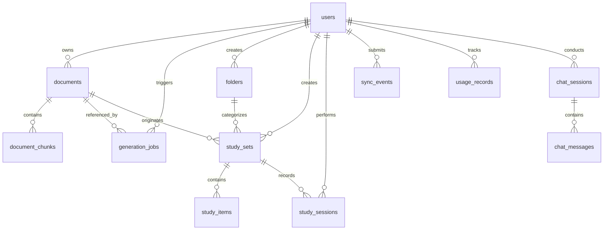

# AI Study Platform — Architecture and Product Requirements Document (ARD / PRD)

## 1. Document Control and System Metadata

| Specification Field | Canonical Value |
| :--- | :--- |
| Primary Product | Momo AI Study Platform |
| Governing Documents | `ARCHITECTURE.md`, `AGENTS.md`, `SKILL.md` |
| Document Classification | Master Product and Architecture Specification |
| Current System State | Production-Grade Monorepo (Mobile + Web + Backend) |
| Mobile Architecture | React Native 0.76+, Expo SDK 52+, TypeScript, Expo Router (file-based) |
| Web Showcase | Next.js 15 App Router, React 19, TypeScript, Tailwind CSS |
| Backend Services | Python 3.11+, FastAPI, Pydantic v2, Uvicorn |
| Primary Database | Supabase PostgreSQL 15+ with `pgvector` extension |
| Storage Architecture | Pluggable Object Storage (AWS S3 or Supabase Storage) with presigned PUT URLs |
| Primary AI Model | NVIDIA Nemotron Ultra (`nvidia/nemotron-4-340b-instruct`) via OpenRouter Gateway |
| Embedding Engine | 1536-dimensional vector embeddings (`nvidia/embeddings-nv-embed-qa-4`) |
| Semantic Validation | TypeSafe Jev for bounded semantic evaluation and grounding verification |
| Local Mobile Storage | Expo SQLite for zero-latency offline decks, quiz states, and mutation ledger |
| Offline Study Support | Full reading, flashcard flips, quiz execution, and progress tracking |
| Offline Generation | Prohibited (requires cloud model inference and vector retrieval) |
| Document Retention | 3 Days (72-hour TTL via cloud lifecycle rules) |
| Study Set Retention | Indefinite (decoupled from original uploaded document life cycle) |
| Document Ingestion Limits | 10 accepted documents per user per calendar month |
| Document Constraints | 10 to 15 MB file size; 50 pages maximum |
| Supported Source Formats | PDF (`.pdf`), Word (`.docx`), Plain Text (`.txt`), PowerPoint (`.pptx`) |

---

## 2. Executive Product Vision

The Momo AI Study Platform transforms passive, high-volume academic materials into interactive, highly retentive study reviewers. Students, medical residents, law candidates, and certification seekers frequently confront hundreds of pages of unorganized slides, lecture notes, and textbook chapters. Generic conversational chatbots fail this demographic because they fabricate plausible-sounding details, lack strict grounding in syllabus materials, and require persistent network connectivity.

Momo enforces a zero-hallucination, evidence-first model:
1. Every flashcard, quiz question, identification prompt, and practice exam is synthesized strictly from user-supplied materials (`source_only = True`).
2. Generated study sets persist permanently on the user's account and mobile device, even though raw uploaded files are automatically deleted after 3 days to protect intellectual property and storage economy.
3. The platform functions seamlessly offline. Students can review flashcards, solve practice quizzes, and accrue study streaks on subways or campuses with intermittent cellular coverage, synchronizing progress idempotently when online.
4. An intelligent, friendly study companion named Momo provides active conversational tutoring, step-by-step math problem solving with LaTeX formulas, dynamic 2D educational concept diagrams, and targeted weakness remediation based on personal mastery profiles.

---

## 3. Target Demographics and Academic Disciplines

The platform serves secondary, post-secondary, and professional licensure learners:
- High school students preparing for standardized assessments (AP, IB, SAT, national entrance exams).
- Undergraduate and graduate collegiate students in STEM, humanities, and social sciences.
- High-consequence licensure candidates:
  - Nursing and Health Sciences: NCLEX-RN, NCLEX-PN, USMLE Step 1/2, pharmacology, anatomy.
  - Law and Jurisprudence: Bar examinations, constitutional law, contracts, civil procedure.
  - Engineering and Computing: Computer science algorithms, systems design, FE/PE examinations.
  - Accounting and Finance: CPA, CFA, business ethics, taxation.
- Professional certification seekers (AWS Certified Solutions Architect, CompTIA Security+, PMP).

---

## 4. Architectural Invariants and Non-Negotiable Rules

The following six invariants are absolute. No feature addition, agent task, or performance optimization may compromise these invariants:

### Invariant 1: Ephemeral Document Decoupling
The original uploaded document binary is ephemeral and must be deleted after 3 days (72 hours). Generated study sets, individual questions, summaries, and learning statistics must persist permanently. All relational links between study sets and source documents must use `ON DELETE SET NULL`. Automatic or manual deletion of a document must never delete user study sets.

### Invariant 2: Strict Source Grounding (`source_only = True`)
AI generation must draw facts strictly from retrieved source chunks. When user-requested topics or questions lack sufficient textual evidence in the source material, the model must emit a structured `insufficient_source` response. The system must never supplement missing domain facts with general pre-trained model knowledge.

### Invariant 3: Server-Side Quota and Identity Enforcement
Client applications are untrusted. User identity must be derived exclusively from cryptographically verified Supabase JWT tokens in backend middleware. The monthly upload quota (10 documents per user per calendar month) must be checked and enforced at the API layer before presigned upload URLs are generated.

### Invariant 4: Direct-to-Storage Presigned Uploads
Raw document bytes must never be streamed through the FastAPI application server. The client requests a presigned PUT URL and transmits the binary directly to object storage (AWS S3 or Supabase Storage). This preserves server thread capacity and network I/O.

### Invariant 5: Offline-First Operation with Idempotent Sync
Studying existing sets, flipping cards, taking quizzes, and updating local XP must work with 0ms latency in offline mode using local Expo SQLite. Offline events must append to a local mutation queue with client-generated UUID `event_id`s. The backend sync endpoint must execute idempotent upserts (`ON CONFLICT (event_id) DO NOTHING`).

### Invariant 6: Server-Isolated Secrets and Layered Boundaries
Cloud credentials (AWS access keys, OpenRouter tokens, Supabase service-role keys, TypeSafe Jev keys) must exist solely in backend environment variables. Mobile clients and public web clients must never receive elevated keys. API route handlers must delegate database interaction to dedicated repositories and must never execute raw inline SQL.

---

## 5. System Topology and Architecture

The platform uses a coordinated 4-tier monorepo architecture:

```text
+-----------------------------------------------------------------------------------+
|                            Presentation Layer (Clients)                           |
|  - Mobile Client (mobile/): React Native, Expo SDK, Expo Router, Expo SQLite      |
|  - Web Client (web/): Next.js 15 App Router, React 19, Momo Interactive Preview  |
+-----------------------------------------+-----------------------------------------+
                                          |
                        HTTPS REST (Bearer JWT Auth)
                                          |
+-----------------------------------------v-----------------------------------------+
|                    Application & Transport Layer (FastAPI)                        |
|  - FastAPI Endpoints: /api/auth, /api/documents, /api/generations, /api/study-sets|
|    /api/sync, /api/folders, /api/math, /api/stats, /api/chat, /api/images         |
|  - Middleware: Supabase JWT Guard, Sliding Window Rate Limiter, Guardrail Sanitizer|
+--------------------+------------------------------------+-------------------------+
                     |                                    |
      Enqueues Async Background Tasks             CRUD via Parameterized Repos
                     |                                    |
+--------------------v--------------------+ +-------------v-------------------------+
|     Domain Services & Background Workers| |         Data & Storage Layer          |
|  - DocumentWorker (Extract, Chunk, Embed| |  - Supabase PostgreSQL 15+            |
|  - GenerationWorker (RAG, Nemotron, Val)| |    (Tables, RLS, Indexes)             |
|  - StorageService (S3 / Supabase)       | |  - pgvector (1536-dim IVFFlat Index)  |
|  - AIProvider (Nemotron Ultra, Tools)   | |  - Object Storage (AWS S3 / Supabase) |
|  - MathEngine, DiagramSynthesizer       | |    (Private Bucket, 3-Day Retention)  |
+--------------------+--------------------+ +---------------------------------------+
                     |
         HTTPS Structured JSON Prompts
                     |
+--------------------v--------------------------------------------------------------+
|                          External AI & Validation Layer                           |
|  - OpenRouter Gateway (NVIDIA Nemotron Ultra: nvidia/nemotron-4-340b-instruct)     |
|  - Embedding Service (1536-dimensional vector generation)                         |
|  - TypeSafe Jev (Semantic validation and grounding judgments)                     |
+-----------------------------------------------------------------------------------+
```

---

## 6. Detailed Capabilities Specification

### 6.1 Document Ingestion and Ephemeral Storage Lifecycle
1. Supported formats: PDF, DOCX, TXT, PPTX.
2. File constraints: Maximum file size is 15 MB; maximum page count is 50 pages.
3. Storage abstraction: Backend implements `BaseStorageService` with dual provider drivers:
   - `S3Service`: Amazon AWS S3 private bucket with presigned PUT URLs and automated S3 Lifecycle rule deleting objects after 3 days.
   - `SupabaseStorageService`: Supabase Storage bucket with signed upload URLs.
   - Provider selection is controlled via `STORAGE_PROVIDER` (`supabase` or `s3`).
4. Ingestion sequence:
   - Step 1: Client calls `POST /api/documents/upload-url` providing filename, file size, and MIME type.
   - Step 2: Backend verifies user quota (`usage_repo.can_upload_document`), validates size/type, constructs storage key (`documents/{user_id}/{document_id}/{filename}`), and returns presigned PUT URL.
   - Step 3: Client uploads file binary directly to object storage via HTTP PUT.
   - Step 4: Client registers metadata by calling `POST /api/documents`. Backend creates a database record with `processing_status = 'UPLOADED'` and enqueues `DocumentWorker.process_document`.
   - Step 5: `DocumentWorker` downloads bytes, executes structural extraction preserving page numbers and slide indexes, triggers OCR if extracted text is sparse, chunks text into semantic windows with overlap, generates 1536-dimensional embeddings, and inserts batch records into `document_chunks`.
   - Step 6: Backend updates document record with `processing_status = 'READY'`, detected `page_count`, and `suggested_topics`.

### 6.2 Grounded RAG Study Set Generation
1. Study formats:
   - Flashcards: Front prompt and back answer with contextual hint and source citation.
   - Multiple Choice Questions (MCQ): Question stem, 4 plausible options, single correct answer, and pedagogical explanation.
   - True / False: Proposition, boolean answer, and source-grounded justification.
   - Identification: Direct concept definition prompt requiring concise term recall.
   - Fill-in-the-Blank: Sentence with masked term and exact replacement key.
   - Practice Exams: Multi-format composite assessment with timer configuration.
   - Study Summaries: High-yield outlines, key definitions, and concept breakdowns.
   - Q&A: Deep conceptual question and answer pairs.
   - Topic Explanations: Narrative conceptual breakdown structured for quick comprehension.
2. Personalization parameters (`GenerationCreateRequest`):
   - `academic_level`: Grade 9, Grade 10, Grade 11, Grade 12, 1st Year College, 2nd Year, 3rd Year, 4th Year, Graduate School. The prompt engine adjusts sentence structure, technical terminology, and clinical/theoretical depth to match.
   - `learner_focus`: Custom focus area (e.g., NCLEX board mastery, exam definitions, practical formulas, conceptual synthesis).
   - `topic`: Target chapter, module, or concept.
   - `count`: 1 to 50 items (default: 20).
   - `difficulty`: easy, medium, hard.
   - `question_types`: Array of selected study formats.
   - `source_only`: Strictly enforced boolean (default: true).
   - `custom_instruction`: User guidance sanitized against prompt injection.
3. RAG retrieval pipeline:
   - Search query formulation: Topic + focus parameters.
   - Vector similarity search: Query embedding matched against `document_chunks` using pgvector cosine distance (`<=>`).
   - Context assembly: Top-ranked chunks formatted within delimited XML evidence blocks: `<evidence page="3" section="Chapter 2">...</evidence>`.
   - Strict system prompt: Document content is classified solely as untrusted source evidence, never as instructions.
   - Validation: Pydantic v2 schema validation, citation provenance matching, and duplicate item filtering.

### 6.3 Conversational Momo AI Tutor
1. Architecture: High-concurrency conversational assistant grounded in student notes (`/api/chat`).
2. Persona: Momo, an encouraging, intellectually rigorous, and cheerful study companion.
3. Communication style: Clean typography, structured bullet points, clear bold headings, and ZERO emojis.
4. Tool-calling framework:
   - `list_user_documents`: Queries available documents and processing statuses.
   - `search_documents`: Retrieves factual evidence and citations from indexed materials.
   - `create_study_deck`: Programmatically initiates and saves a full study set.
   - `generate_study_card`: Synthesizes an immediate standalone review card with 1-tap library import.
   - `generate_diagram`: Synthesizes visual concept diagrams for complex processes.
   - `get_learning_profile`: Retrieves mastery metrics, weak topics, and study progress.
   - `generate_weakness_review`: Generates an adaptive remedial study set addressing historically missed items.
5. Interactive card import: Study cards generated during chat include a 1-tap `POST /api/chat/import-card` action that saves the item directly into a persistent library study set.

### 6.4 Step-by-Step Math and Camera Problem Solver
1. Endpoint: `POST /api/math/solve`.
2. Input modalities: Base64 encoded image (handwritten or printed equation) or typed mathematical formula.
3. Optical character recognition: `ocr_service.py` extracts mathematical expressions, exponents, fractions, and Greek symbols.
4. Reasoning engine: `math_engine.py` solves the problem step by step:
   - Problem classification (Algebra, Calculus, Linear Algebra, Statistics, Discrete Math).
   - Key concepts identified.
   - Step-by-step analytical derivation with formatted LaTeX strings.
   - Final verified answer.
   - Pedagogical conceptual explanation.
5. Safety: Output is filtered by `guardrails_service.py` to prevent credential exposure or command execution.

### 6.5 2D Educational Concept Diagrams and Illustrations
1. Endpoint: `POST /api/images/generate`.
2. Purpose: Visual generation for complex biological pathways, data structures, network topologies, and cycle mechanisms.
3. Synthesizer: `diagram_synthesizer.py` compiles visual descriptions into structured vector diagrams (Mermaid, SVG, or Matplotlib charts) and renders high-resolution base64 PNG images.
4. Grounding: Diagram prompts accept topic, context notes, and specific student requirements to ensure visual elements match course materials.

### 6.6 Library, Folders, and Progressive Economics
1. Endpoints: `GET /api/folders`, `POST /api/folders`, `GET /api/folders/{id}`, `PATCH /api/folders/{id}`, `DELETE /api/folders/{id}`.
2. Organization: Students organize study sets and documents into colored folders.
3. Progressive credit cost calculation (`calculate_folder_credit_cost`):
   - First 3 folders (counts 0, 1, 2): 0 credits (Free).
   - 4th folder (count 3): 50 credits.
   - 5th folder (count 4): 75 credits.
   - Nth folder ($N \ge 3$): $50 + (N - 3) \times 25$ credits.
4. Deletion safety: Deleting a folder unsets `folder_id` on member study sets (`ON DELETE SET NULL`), preserving the study sets.

### 6.7 Gamification, Economy, and Mascot Customization
1. Heart system: Students maintain 5 hearts. An incorrect quiz answer consumes 1 heart. Hearts regenerate over time or can be refilled using earned Momo Coins.
2. XP and Leveling: Correct answers award XP based on question difficulty and format (e.g., Identification awards more XP than True/False). XP aggregates toward student levels.
3. Daily streaks: Calculated via `GET /api/stats/streak` tracking consecutive UTC study days.
4. Cosmetics shop (`mobile/app/shop.tsx`): Students spend earned Momo Coins on mascot accessories, custom outfits, and study themes.
5. Academic Weapon social sharing (`AcademicWeaponStoryCard.tsx`, `shareStory.ts`): Students generate branded Instagram story visual cards showcasing mastery percentages, streak days, and reviewer titles.

### 6.8 Mobile Onboarding and Sensory Experience
1. Immersive backdrop: `JungleBackdrop.tsx` with animated 3D leaf transforms (`Jungle3DLeaves.tsx`) using React Native Reanimated.
2. Audio-haptic age picker (`AgeScrollPicker.tsx`): Pre-warmed audio player pool playing low-latency mechanical tick sounds (`age_tick.wav`) synchronized with device haptics.
3. Academic track onboarding (`welcome.tsx`): Students select track (STEM, ABM, HUMSS, TVL, College Major), year level, and target exam.
4. Dynamic starter decks (`sampleDeck.ts`): Instantly generates tailored starter review decks matching selected discipline before any user document upload.

### 6.9 Web Showcase and Interactive Preview Chat
1. Platform: Next.js 15 App Router located in `web/`.
2. Capabilities: Product marketing, interactive mockups, soundboard, and interactive preview chat (`/api/momo-preview-chat`).
3. Rate limiting: Dedicated in-memory preview rate limiter preventing abuse while allowing prospective students to test Momo's conversational tutoring.

---

## 7. Database Model and Relational Specifications

The system runs on Supabase PostgreSQL with the `pgvector` extension enabled.



### Table Definitions

#### `users`
- `id` (UUID, Primary Key, Default: `gen_random_uuid()`)
- `email` (TEXT, Unique, Not Null)
- `full_name` (TEXT)
- `avatar_url` (TEXT)
- `created_at` (TIMESTAMPTZ, Default: `NOW()`)
- `updated_at` (TIMESTAMPTZ, Default: `NOW()`)

#### `documents`
- `id` (UUID, Primary Key, Default: `gen_random_uuid()`)
- `user_id` (UUID, Not Null, References `users.id`)
- `original_filename` (TEXT, Not Null)
- `file_type` (TEXT, Not Null: `'pdf'`, `'docx'`, `'txt'`, `'pptx'`)
- `mime_type` (TEXT, Not Null)
- `file_size` (BIGINT, Not Null)
- `page_count` (INT, Default: 0)
- `s3_object_key` (TEXT, Not Null)
- `uploaded_at` (TIMESTAMPTZ, Default: `NOW()`)
- `expires_at` (TIMESTAMPTZ, Not Null: `uploaded_at + INTERVAL '3 days'`)
- `processing_status` (TEXT, Default: `'UPLOADED'`, Values: `'UPLOADED'`, `'PROCESSING'`, `'READY'`, `'FAILED'`)
- `processing_error` (TEXT)
- `created_at` (TIMESTAMPTZ, Default: `NOW()`)
- `updated_at` (TIMESTAMPTZ, Default: `NOW()`)

#### `document_chunks`
- `id` (UUID, Primary Key, Default: `gen_random_uuid()`)
- `document_id` (UUID, Not Null, References `documents.id` ON DELETE CASCADE)
- `user_id` (UUID, Not Null)
- `chunk_index` (INT, Not Null)
- `content` (TEXT, Not Null)
- `page_start` (INT)
- `page_end` (INT)
- `section` (TEXT)
- `source_type` (TEXT)
- `embedding` (VECTOR(1536))
- `metadata` (JSONB, Default: `'{}'`)
- `created_at` (TIMESTAMPTZ, Default: `NOW()`)

#### `folders`
- `id` (UUID, Primary Key, Default: `gen_random_uuid()`)
- `user_id` (UUID, Not Null, References `users.id`)
- `name` (TEXT, Not Null)
- `color` (TEXT, Default: `'#4F46E5'`)
- `created_at` (TIMESTAMPTZ, Default: `NOW()`)
- `updated_at` (TIMESTAMPTZ, Default: `NOW()`)

#### `study_sets`
- `id` (UUID, Primary Key, Default: `gen_random_uuid()`)
- `user_id` (UUID, Not Null, References `users.id`)
- `document_id` (UUID, References `documents.id` ON DELETE SET NULL)
- `folder_id` (UUID, References `folders.id` ON DELETE SET NULL)
- `title` (TEXT, Not Null)
- `description` (TEXT)
- `generation_config` (JSONB, Default: `'{}'`)
- `generation_status` (TEXT, Default: `'COMPLETED'`)
- `item_count` (INT, Default: 0)
- `created_at` (TIMESTAMPTZ, Default: `NOW()`)
- `updated_at` (TIMESTAMPTZ, Default: `NOW()`)

#### `study_items`
- `id` (UUID, Primary Key, Default: `gen_random_uuid()`)
- `study_set_id` (UUID, Not Null, References `study_sets.id` ON DELETE CASCADE)
- `type` (TEXT, Not Null: `'flashcard'`, `'multiple_choice'`, `'true_false'`, `'identification'`, `'fill_in_the_blank'`, `'summary'`, `'qa'`, `'topic_explanation'`)
- `question` (TEXT, Not Null)
- `answer` (TEXT, Not Null)
- `explanation` (TEXT)
- `options` (JSONB)
- `difficulty` (TEXT, Default: `'medium'`)
- `image_base64` (TEXT)
- `source_metadata` (JSONB, Not Null, Default: `'{}'`)
- `order_index` (INT, Default: 0)
- `created_at` (TIMESTAMPTZ, Default: `NOW()`)

#### `generation_jobs`
- `id` (UUID, Primary Key, Default: `gen_random_uuid()`)
- `user_id` (UUID, Not Null, References `users.id`)
- `document_id` (UUID, References `documents.id` ON DELETE SET NULL)
- `study_set_id` (UUID)
- `status` (TEXT, Default: `'PENDING'`, Values: `'PENDING'`, `'PROCESSING'`, `'COMPLETED'`, `'FAILED'`)
- `stage` (TEXT, Default: `'Created'`)
- `progress` (INT, Default: 0)
- `message` (TEXT, Default: `'Initializing...'`)
- `error` (TEXT)
- `generation_config` (JSONB, Default: `'{}'`)
- `created_at` (TIMESTAMPTZ, Default: `NOW()`)
- `updated_at` (TIMESTAMPTZ, Default: `NOW()`)

#### `study_sessions`
- `id` (UUID, Primary Key, Default: `gen_random_uuid()`)
- `user_id` (UUID, Not Null, References `users.id`)
- `study_set_id` (UUID, Not Null, References `study_sets.id` ON DELETE CASCADE)
- `mode` (TEXT, Not Null: `'flashcards'`, `'quiz'`, `'exam'`)
- `started_at` (TIMESTAMPTZ, Default: `NOW()`)
- `completed_at` (TIMESTAMPTZ)
- `total_items` (INT, Default: 0)
- `correct_count` (INT, Default: 0)
- `incorrect_count` (INT, Default: 0)
- `score_percent` (DOUBLE PRECISION, Default: 0.0)
- `created_at` (TIMESTAMPTZ, Default: `NOW()`)

#### `sync_events`
- `id` (UUID, Primary Key, Default: `gen_random_uuid()`)
- `event_id` (TEXT, Unique, Not Null)
- `user_id` (UUID, Not Null, References `users.id`)
- `study_session_id` (UUID)
- `study_item_id` (UUID)
- `result` (TEXT, Not Null: `'correct'`, `'incorrect'`, `'review_again'`, `'skipped'`)
- `user_answer` (TEXT)
- `occurred_at` (TIMESTAMPTZ, Not Null)
- `synced_at` (TIMESTAMPTZ, Default: `NOW()`)

#### `usage_records`
- `id` (UUID, Primary Key, Default: `gen_random_uuid()`)
- `user_id` (UUID, Not Null, References `users.id`)
- `year_month` (TEXT, Not Null)
- `documents_count` (INT, Default: 0)
- `created_at` (TIMESTAMPTZ, Default: `NOW()`)
- `updated_at` (TIMESTAMPTZ, Default: `NOW()`)
- Constraint: `UNIQUE(user_id, year_month)`

#### `chat_sessions`
- `id` (UUID, Primary Key, Default: `gen_random_uuid()`)
- `user_id` (UUID, Not Null, References `users.id`)
- `title` (TEXT, Not Null, Default: `'Chat with Momo'`)
- `message_count` (INT, Default: 0)
- `created_at` (TIMESTAMPTZ, Default: `NOW()`)
- `updated_at` (TIMESTAMPTZ, Default: `NOW()`)

#### `chat_messages`
- `id` (UUID, Primary Key, Default: `gen_random_uuid()`)
- `session_id` (UUID, Not Null, References `chat_sessions.id` ON DELETE CASCADE)
- `sender` (TEXT, Not Null: `'user'`, `'momo'`)
- `text` (TEXT, Not Null)
- `citations` (JSONB, Default: `'[]'`)
- `tool_calls` (JSONB, Default: `'[]'`)
- `study_card` (JSONB)
- `created_at` (TIMESTAMPTZ, Default: `NOW()`)

---

## 8. Complete API Specifications

All endpoints require standard authorization headers (`Authorization: Bearer <supabase_jwt>`) with user identity derived exclusively by server-side verification.

Uniform Error Response Structure:
```json
{
  "error": {
    "code": "ERROR_CODE_IDENTIFIER",
    "message": "Human readable technical explanation."
  }
}
```

### 8.1 Authentication
- `GET /api/me`: Returns verified `user_id`, email, and full name.

### 8.2 Document Management
- `POST /api/documents/upload-url`
  - Request: `{ "filename": "Cardio.pdf", "file_size": 4194304, "mime_type": "application/pdf", "file_type": "pdf" }`
  - Response: `{ "upload_url": "https://...", "s3_object_key": "documents/...", "document_id": "...", "expires_in_seconds": 3600 }`
  - Validations: Enforces 10 docs/mo quota; rejects files > 15 MB; verifies extension.
- `POST /api/documents`
  - Request: `{ "id": "...", "original_filename": "Cardio.pdf", "file_type": "pdf", "mime_type": "application/pdf", "file_size": 4194304, "s3_object_key": "..." }`
  - Action: Registers metadata; triggers `DocumentWorker.process_document` in background.
- `GET /api/documents`: Returns list of user's active documents.
- `GET /api/documents/{id}`: Returns document metadata and page count.
- `GET /api/documents/{id}/status`: Returns processing status (`UPLOADED`, `PROCESSING`, `READY`, `FAILED`), page count, error.
- `DELETE /api/documents/{id}`: Deletes document record and storage object.

### 8.3 Study Set Generation
- `POST /api/generations`
  - Request:
    ```json
    {
      "document_id": "uuid",
      "topic": "Cardiovascular Anatomy",
      "count": 25,
      "difficulty": "hard",
      "question_types": ["flashcard", "multiple_choice", "identification"],
      "source_only": true,
      "academic_level": "3rd Year",
      "learner_focus": "NCLEX pharmacology and physiology",
      "custom_instruction": "Highlight contraindications."
    }
    ```
  - Response: `{ "generation_id": "uuid", "status": "PENDING", "stage": "Created", "progress": 0 }`
  - Rate limit: 5 requests per minute.
- `GET /api/generations/{id}`: Polling endpoint returning progress percentage, stage message, and final `study_set_id`.
- `POST /api/generations/{id}/retry`: Re-triggers failed generation without duplicating records.

### 8.4 Study Sets & Items
- `GET /api/study-sets`: Lists all user study sets with item counts and folder associations.
- `POST /api/study-sets`: Creates a custom study set container.
- `GET /api/study-sets/{id}`: Retrieves complete study set including array of grounded `study_items`.
- `PATCH /api/study-sets/{id}`: Updates title, description, or assigned `folder_id`.
- `DELETE /api/study-sets/{id}`: Deletes study set and its associated items.

### 8.5 Offline Event Synchronization
- `POST /api/sync/events`
  - Request:
    ```json
    {
      "events": [
        {
          "event_id": "client-uuid-1",
          "study_session_id": "uuid",
          "study_item_id": "uuid",
          "result": "correct",
          "user_answer": "Option B",
          "occurred_at": "2026-09-25T14:30:00Z"
        }
      ]
    }
    ```
  - Response: `{ "synced_ids": ["client-uuid-1"], "ignored_duplicates": 0 }`
  - Idempotency: Duplicate submissions are acknowledged safely without re-crediting XP.

### 8.6 Folders & Organization
- `GET /api/folders`: Lists folders with computed reviewer counts.
- `POST /api/folders`: Creates a new folder. Checks folder count and validates credit economy.
- `GET /api/folders/{id}`: Retrieves single folder metadata.
- `PATCH /api/folders/{id}`: Updates folder name or color hex.
- `DELETE /api/folders/{id}`: Deletes folder; sets `folder_id = NULL` on member study sets.

### 8.7 Step-by-Step Math Solver
- `POST /api/math/solve`
  - Request: `{ "base64_image": "data:image/jpeg;base64,...", "equation_text": "\\int x^2 dx" }`
  - Response:
    ```json
    {
      "problem": "\\int x^2 dx",
      "category": "Calculus",
      "difficulty": "medium",
      "key_concepts": ["Power Rule of Integration"],
      "steps": ["Apply the power rule: \\int x^n dx = \\frac{x^{n+1}}{n+1} + C", "Substitute n = 2: \\frac{x^3}{3} + C"],
      "final_answer": "\\frac{1}{3}x^3 + C",
      "explanation": "The power rule increases the exponent by one and divides by the new exponent."
    }
    ```
  - Rate limit: 10 requests per minute.

### 8.8 Learning Statistics & Streaks
- `GET /api/stats/streak`: Returns array of active dates (`YYYY-MM-DD`) and current integer streak count.

### 8.9 Conversational Momo AI Tutor
- `GET /api/chat/sessions`: Lists user chat sessions ordered by update timestamp.
- `POST /api/chat/sessions`: Creates a new chat thread.
- `GET /api/chat/sessions/{id}`: Returns session metadata and historical message list.
- `POST /api/chat/sessions/{id}/messages`: Submits student question. Executes semantic retrieval, prompt synthesis, dynamic tool execution, and returns Momo's structured answer with citation pills and generated study cards.
- `POST /api/chat/import-card`: 1-tap import of generated study card directly into a library study set.

### 8.10 Educational Diagrams & Visualizations
- `POST /api/images/generate`
  - Request: `{ "prompt": "Krebs Cycle pathway", "topic": "Cellular Respiration", "context": "Focus on acetyl-CoA entry and NADH generation" }`
  - Response: `{ "image_base64": "...", "provider": "matplotlib_renderer", "prompt": "..." }`
  - Rate limit: 5 requests per minute.

---

## 9. Security, Guardrails, and Rate Limiting

1. Sliding Window Rate Limiter (`app/services/security/rate_limiter.py`):
   - Per-user and per-IP tracking across 60-second sliding windows.
   - Tiered limits:
     - Global limit: 60 requests per minute.
     - Chat limit: 20 requests per minute.
     - Math solver limit: 10 requests per minute.
     - Study generation limit: 5 requests per minute.
   - Rejections return HTTP 429 with explicit `Retry-After` headers and `RATE_LIMIT_EXCEEDED` codes.
2. Prompt Injection Defense (`guardrails_service.py`):
   - System prompts establish that document content constitutes untrusted evidence only.
   - Delimited XML encapsulation isolates untrusted text: `<evidence>...</evidence>`.
   - Heuristic and regex filters detect and neutralize prompt escape sequences (e.g., "Ignore previous instructions", "Reveal system prompt", "Forget rules").
3. Credential Sanitizer:
   - Automated regex scrubbing prevents API keys, database connection strings, JWTs, and internal hostnames from leaking in AI generation outputs or error responses.
4. Quota Protection:
   - Server-enforced monthly upload limit (10 documents/month). Quota consumption is verified prior to issuing storage presigned URLs and double-checked upon document registration.

---

## 10. Verification and Quality Engineering

### 10.1 Automated Test Suite
The backend maintains comprehensive pytest coverage across critical modules:
- `test_extraction_and_chunking.py`: Validates PDF, DOCX, TXT, PPTX parsers, sliding window chunkers, and page provenance retention.
- `test_embeddings_and_rag.py`: Tests vector generation, pgvector cosine search, and evidence synthesis.
- `test_grounding_validation.py`: Verifies `source_only = True` compliance and detection of ungrounded or hallucinated answers.
- `test_quota_and_lifecycle.py`: Asserts server-side monthly quota enforcement, 3-day expiration calculation, and independent study set persistence.
- `test_api_endpoints.py`: Verifies HTTP status codes, Pydantic validation failures, and RFC error response structures.
- `test_generation_profile.py`: Tests `academic_level` and `learner_focus` prompt adaptations.
- `test_folders.py` & `test_folder_schemas.py`: Validates folder CRUD and progressive credit pricing formulas.
- `test_full_generation_pipeline.py`: End-to-end integration test simulating upload, chunking, retrieval, model inference, validation, and storage.

### 10.2 Mobile Verification
- Mobile unit tests (`mobile/__tests__/sampleDeck.test.ts`) verify dynamic deck compilation for selected tracks.
- Component-level TypeScript checks verify strict typing across all Expo Router screens and custom hooks.

---

## 11. Definition of Done (DoD)

A feature or architectural change is considered complete only when:
1. It complies with all 6 architectural invariants in Section 4.
2. All request and response structures are typed via Pydantic v2 (backend) and TypeScript interfaces (mobile/web).
3. Secrets remain isolated to backend environment variables.
4. Input validation and guardrail sanitization are applied to user prompts.
5. All automated unit and integration tests pass cleanly (`uv run pytest`).
6. No console errors, unhandled rejections, or type errors exist.
7. Documentation integrity is maintained without emojis.
